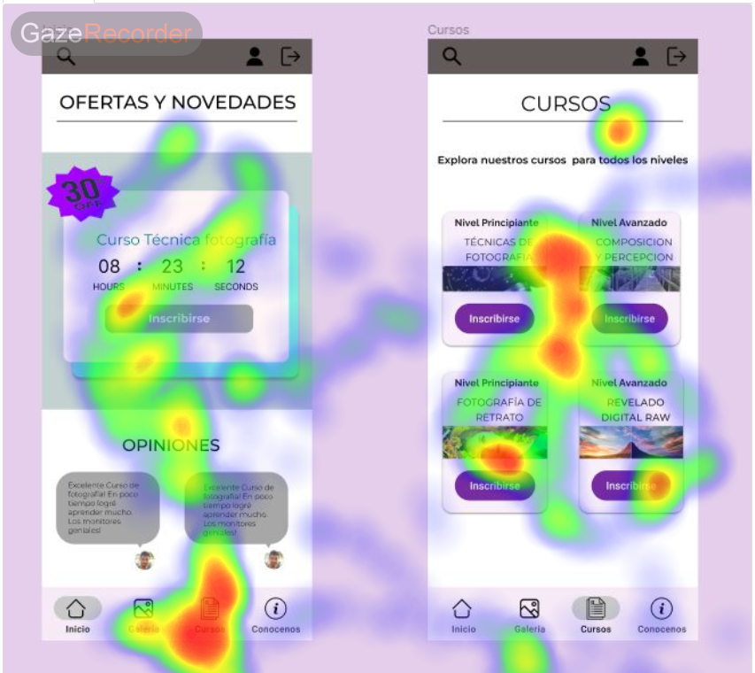
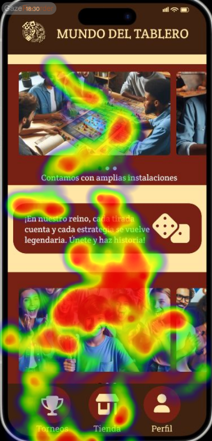
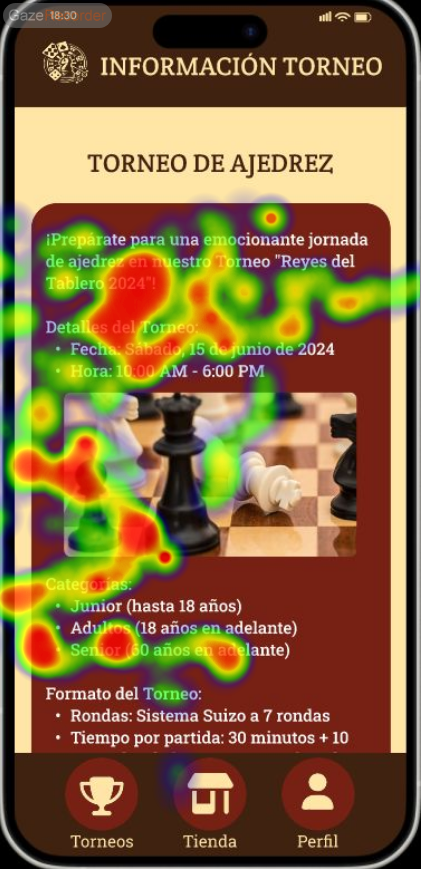

# DIU24
Prácticas Diseño Interfaces de Usuario 2023-24 (Tema: Granaventour ) 

Grupo: DIU3_TecladoyRaton.  Curso: 2023/24 
Updated: 11/2/2024

Proyecto: 
Foto Élite

Descripción: 
Se trata de una página web de un club de fotografía en el que se imparten cursos y conocimientos sobre el mundo de la fotografía y permite a las personas poder conocer más sobre este campo.

Logotipo: 

Miembros
 * :bust_in_silhouette:   Carlos Fernandez Arrabal     :octocat:     
 * :bust_in_silhouette:  Jaime Parra Jiménez     :octocat:

----- 

# Proceso de Diseño 

## Paso 1. UX User & Desk Research & Analisis 

 **1.a User Reseach Plan**
-----
En el User Research hemos realizado un análisis de interfaces de usuario relacionadas con el sector turístico en Granada. El propósito de este análisis es poder ver cómo distintos usuarios utilizan una la misma página web y reaccionan a ella.

 1.b Competitive Analysis
-----
Hemos realizado un análisis entre tres empresas dedicadas al mismo sector, de diferentes sitios y que atienden al mismo sector de usuarios. Tras el correcto análisis tomamos como ganadora a "Nevadensis" ya que es la aplicación que mejores prestaciones nos da, ya que sus precios son competitivos, tienes muchas actividades y ademas su interfaz es muy buena y intuitiva.

 1.c Persona
-----
Para el desarrollo de esta práctica hemos crado dos personas distintas:
- **Persona 1:**  Una profesora de 35 años, amante de las aventuras de riesgo, cansada de realizar siempre el mismo tipo de actividades. Busca poder experimentar algo épico y apasioante, que le haga descubrir nuevas emociones.
- **Persona 2:** Un informático de 28 años que busca nuevos hobbies para evadirse de su trabajo.
Las capturas sobre cada persona se encuentran en la P1. 

 1.d User Journey Map
----
En cuanto al mapa de cada persona se puede destacar:
- **Persona 1:** La chica ha tenido una experiencia con grandes altibajos ya que las difcultades por recabar información y algunas acciones de la web le han dejado insatisfecha. Sin embargo, sigue motivada gracias al apoyo de sus compañeros y de su pareja.
- **Persona 2:** El chico busca mejorar física y mentalmente buscando un deporte que le guste por lo que busca opiniones de personas con su mismo problema el problema es que no termina de encontrar que actividad cumple con sus requisitos.

 1.e Usability Review
----
A continuación se detallan los diferentes puntos de este apartado:
 - **Enlace al documento:**  [(sube a github el xls/pdf) ](https://github.com/bete2043/DIU/blob/master/P1/Usability-review-template.xlsx)
 - **Valoración final (numérica):** 73
 - **Comentario sobre la valoración:** (60-120 caracteres)Nos ha salido una valoración de 73, esto indica que la aplicación esta bien aunque hay algunas cosas que hay que mejorar. Unas de las cosas que hay que mejorar es el buscador ya que no permite hacer búsquedas con filtros. Por lo demás la interface esta bien realizada ya que cumple con todo lo necesario para ofrecer un servicio de calidad necesario para poder reservar cualquier actividad que deseemos. En conclusión, la aplicación esta bien hecha por lo que ofrece al usuario un buen servicio cumpliendo con todas las espectativas de este.

## Paso 2. UX Design  

 2.a Reframing / IDEACION: Feedback Capture Grid / EMpathy map 
----

>>> Comenta con un diagrama los aspectos más destacados a modo de conclusion de la práctica anterior,

 Interesante | Críticas     
| ------------- | -------
  Preguntas | Nuevas ideas
  
    
>>> ¿Que planteas como "propuesta de valor" para un nuevo diseño de aplicación para economia colaborativa ?
>>> Problema e hipótesis
>>>  Que planteas como "propuesta de valor" para un nuevo diseño de aplicación para economia colaborativa te
>>> (150-200 caracteres)

 2.b ScopeCanvas
----
>>> Propuesta de valor 

 2.b User Flow (task) analysis 
-----

>>> Definir "User Map" y "Task Flow" ... 

 2.c IA: Sitemap + Labelling 
----

>>> Identificar términos para diálogo con usuario  

Término | Significado     
| ------------- | -------
  Login¿?  | acceder a plataforma

 2.d Wireframes
-----

>>> Plantear el  diseño del layout para Web/movil (organización y simulación ) 

## Paso 3. Mi UX-Case Study (diseño)

 3.a Moodboard
-----
Nuestro moodboard aborda 6 apartados esenciales para el desarrollo: Colores, Logo, Eslogan, Tipografía, Imágenes inspiradoras y Comentarios de usuarios.
Para el logotipo hemos usado la web designevo. Cuenta con grandes plantillas y formas de diseño. Nuestro logo tiene varias versiones, variando en estas los colores y letra. Empleamos tonalidades blanco/negro y azules.

  3.b Landing Page
----

 3.c Guidelines
----
### Menú de navegación
Permite la navegación por las diferentes secciones de la página. Algunos elementos destacables:
- **Iconos:** Indica el sitio de la aplicación donde se encuentra el usuario.
  
### Barra de navegación
Permite al usuario la búsqueda de todo tipo de contenidos relaciones con el club (cursos, galerías, nuestro equipo...)

### Cartas
Contenedores llamativos, que ilustran información relevante acompañados de una imagen representativa. Permiten al usuario poder inscribirse o consular mediante un botón más información al respecto. Algunas partes esenciales son:
- **Título** 
- **Imagen**
- **Descripción**
- **Botón**
 
### Botones
Permite al usuario realizar acciones claves dentro de la páginas como inscribirse, subir una publicación, publicar un nuevo comentario en el foro....

### Carrito de Compra
Implementa una sección dentro de la página para que el usuario pueda procesar los productos añadidos a la cesta. Incluye tanto una parte de añadir/eliminar productos así como consultar precios y otra de proceso de pago (datos bancarios).

### Formulario
Se trata de una zona de registro para nuevos usuarios o de inicio de sesión para aquellos ya registrados. También hay otro formulario de inscripción para los cursos disponibles y para poder publicar una nueva foto. Algunos elementos son:
- **Campo de texto**
- **Botón de confirmaciónn**

### Carrousel
Gracias a esto, se pueden mostrar una serie de  imágenes y comentarios de forma seguida, en un mismo espacio dentro de la página.

  3.d Mockup
----
[Enlace](https://www.figma.com/design/dLHjxgrZM3L5WOI7Do9CoY/Guidelines-%26-Layout?node-id=77%3A830&t=JlTJYw2a5UhbiYQ6-1)

 3.e ¿My UX-Case Study?
-----
Tras el correspondiente estudio y desarrollo de las diferentes secciones de la práctica podemos definir nuestro producto como una aplicación basada en un club de fotografía de granada, que ofrece todo tipo de posiblidades para poder aprender sobre el mundo de la fotografía para todo tipos de niveles. Los integrantes se presentan como un equipo cercano y con experiencia, con ganas de enseñar y poner en práctica todos sus conocimientos. La aplicación ofrece cursos para gente nueva y experimentada, atrayendo a todo tipo de públicos.
Durante el desarrollo de la práctica se han tenido diferentes problemas como la dificultad de adaptar los bocetos al diseño layout, establecer un menu de navegación visible o adaptar el diseño a móvil. Estos problemas han sido resultos y han llevado a la elavoración de un buen diseño layout.
Además, algunos de los patrones de diseño que se han usado han sido formularios, menu de navegación, carrito de compra, conocenos, carrusel de imágenes, calendario y cartas informativas. Todos estos patrones han sido adaptados a nuestra aplicación.

## Paso 5. Exportación & evaluación con Eye Tracking 

Exportación a HTML/Flutter
-----

)  5.b Eye Tracking method 

Para la realización de esta práctica vamos a hacer una comparativa entre nuestra aplicación (A) y otra seleccionada por el profesorado (B). El nombre de los proyectos son: “Foto Élite” que trata sobre un club de fotografía y “Mundo del Tablero” que trata sobre torneos de ajedrez. 
Para hacer esta comparativa de ambos proyectos se elegirán a 4 usuarios diferentes para comprobar la funcionalidad y rendimiento de la página. Dos de ellos se encargarán de probar la aplicación A y los otros dos se encargarán de la aplicación B.    
Se realizarán pruebas de eyetracking a los usuarios de la aplicación B y un cuestionario SUS para obtener resultados sobre la calidad de la aplicación. Para finalizar, se complementará todo ello con un Usabilty Report sobre la aplicación B.

Diseño del experimento 
----

>> Uso de imágenes (preferentemente) -> hay que esablecer una duración de visualización y  
>> fijar las áreas de interes (AoI) antes del diseño. Planificar qué tarea debe hacer el usuario (buscar, comprar...) 

  <b>Caso A</b>

  

---

  <b>Caso B</b>

 

  
  

Resultados y valoración 
-----

>> Cambiar por tus resultados
  

## Paso 4. Evaluación 

 4.a Caso asignado
----

>>> Breve descripción del caso asignado con enlace a  su repositorio Github

 4.b User Testing
----

>>> Seleccione 4 personas ficticias. Exprese las ideas de posibles situaciones conflictivas de esa persona en las propuestas evaluadas. Asigne dos a Caso A y 2 al caso B
 

| Usuarios | Sexo/Edad     | Ocupación   |  Exp.TIC    | Personalidad | Plataforma | TestA/B
| ------------- | -------- | ----------- | ----------- | -----------  | ---------- | ----
| User1's name  | H / 18   | Estudiante  | Media       | Introvertido | Web.       | A 
| User2's name  | H / 18   | Estudiante  | Media       | Timido       | Web        | A 
| User3's name  | M / 35   | Abogado     | Baja        | Emocional    | móvil      | B 
| User4's name  | H / 18   | Estudiante  | Media       | Racional     | Web        | B 

 4.c Cuestionario SUS
----

>>> Usaremos el **Cuestionario SUS** para valorar la satisfacción de cada usuario con el diseño (A/B) realizado. Para ello usamos la [hoja de cálculo](https://github.com/mgea/DIU19/blob/master/Cuestionario%20SUS%20DIU.xlsx) para calcular resultados sigiendo las pautas para usar la escala SUS e interpretar los resultados
http://usabilitygeek.com/how-to-use-the-system-usability-scale-sus-to-evaluate-the-usability-of-your-website/)
Para más información, consultar aquí sobre la [metodología SUS](https://cui.unige.ch/isi/icle-wiki/_media/ipm:test-suschapt.pdf)

>>> Adjuntar captura de imagen con los resultados + Valoración personal 

 4.d Usability Report
----

>> Añadir report de usabilidad para práctica B (la de los compañeros)

>>> Valoración personal 

5.) Conclusion de EVALUACION (A/B testing + usability report + eye tracking) 
----

>> recupera el usability report de tu práctica (que es el caso B de los asignados a otros grupos) 
>> con los resultados del A/B testing, de eye tracking y del usability report:
>>  comentad en 2-3 parrafos cual es la conclusion acerca de la realización de la práctica y su evaluación con esas técnicas y que habéis aprendido

## Conclusión final / Valoración de las prácticas

>>> (90-150 palabras) Opinión FINAL del proceso de desarrollo de diseño siguiendo metodología UX y valoración (positiva /negativa) de los resultados obtenidos  

